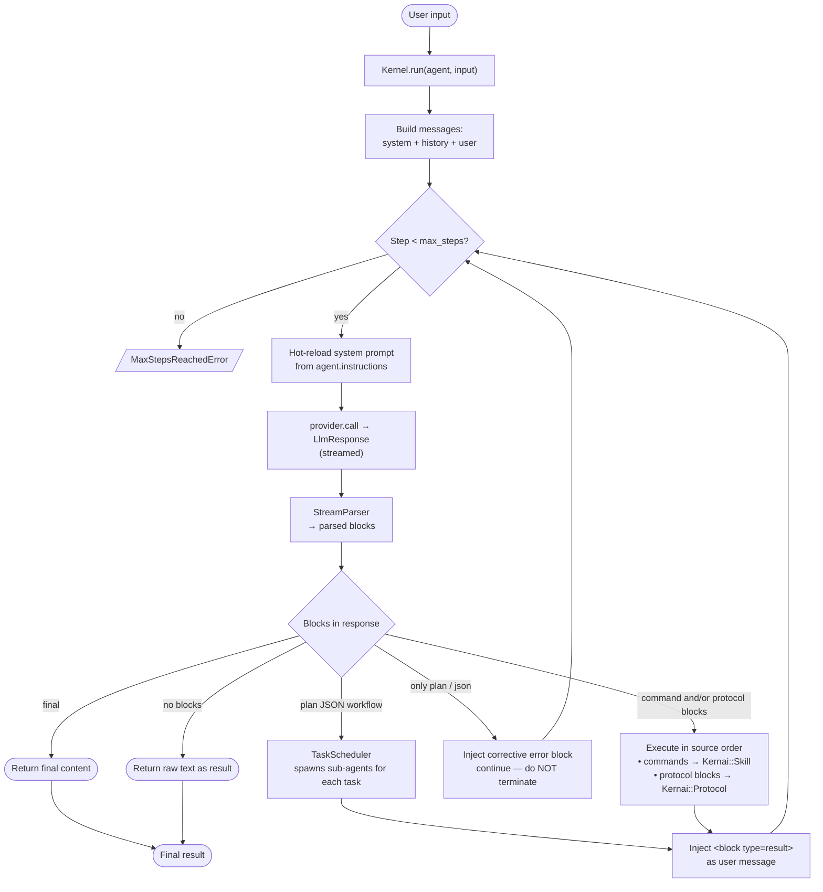
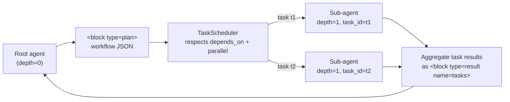
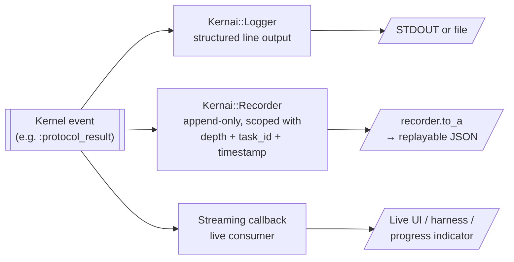

# Kernai

A minimal, extensible Ruby gem for building AI agents through a **universal structured block protocol**. Simple orchestration, dynamic skills, streaming support, full observability — zero external dependencies.

## Philosophy

- **Simplicity** over magic
- **Protocol** over abstraction
- **Backend control** over LLM control
- **Dynamic** over static
- **Pure conversation** over special roles
- **Zero dependencies**

## Installation

Add to your Gemfile:

```ruby
gem "kernai"
```

Or install directly:

```sh
gem install kernai
```

Requires Ruby >= 3.0.

## Quick Start

```ruby
require "kernai"

# 1. Define skills (tools the agent can use)
Kernai::Skill.define(:search) do
  description "Search the knowledge base"
  input :query, String

  execute do |params|
    MySearchEngine.query(params[:query])
  end
end

# 2. Implement a provider (LLM backend)
class MyProvider < Kernai::Provider
  def call(messages:, model:, &block)
    # Call your LLM API here
    # Yield chunks to `block` for streaming
    # Return the complete response string
  end
end

# 3. Create an agent
agent = Kernai::Agent.new(
  instructions: "You are a helpful assistant. Use <block> XML tags to structure your responses.",
  provider: MyProvider.new,
  model: "gpt-4.1",
  max_steps: 10
)

# 4. Run
result = Kernai::Kernel.run(agent, "Find information about Ruby agents") do |event|
  case event.type
  when :text_chunk then print event.data
  when :skill_result then puts "Skill executed: #{event.data[:skill]}"
  when :final then puts "\nDone!"
  end
end
```

## Architecture

### Execution flow

Every call to `Kernai::Kernel.run(agent, input)` walks a single, fully
deterministic loop. Each step produces one LLM response, classifies the
blocks it contains, and dispatches them. The loop keeps going until the
agent emits a `<final>` block, replies with plain prose (no blocks), or
hits `max_steps`.



Key things the diagram encodes:

- **Commands and protocol blocks coexist** on the same rail and are executed
  in the order the LLM emitted them — so a single response can interleave
  `<block type="command" name="...">` and `<block type="mcp">` and both will
  fire deterministically.
- **Informational-only turns don't terminate the loop.** If the agent emits
  only `<plan>` or `<json>` blocks, the kernel injects a corrective error
  block and gives it another step. This accommodates smaller models that
  split reasoning and action across turns.
- **Plain prose with no blocks** still terminates gracefully with the raw
  text as the result — so a pure chatbot agent (no skills, no protocols)
  works without any special case.

### Sub-agents and scoping

A workflow plan block expands into a DAG of sub-agents. Each sub-agent is
an independent `Kernel.run` call with its own context, but it shares the
parent's provider, model, skills and protocols — and, since the fix to
`build_sub_agent`, the **full** `max_steps` budget.



Sub-agents **cannot** emit their own nested workflow plans — `ctx.root?`
gates plan detection. This caps recursion at one level and keeps the
observability tree legible.

### Observability rail

Every meaningful event inside the kernel — LLM request/response, skill
execution, protocol execution, workflow lifecycle, informational-only
branch, task start/complete — fans out to **three destinations at once**.
This is the core of Kernai's "everything is traceable" promise.



Because every emission goes through the same `record(rec, ctx, ...)`
helper, **nothing is ever recorded without its execution scope** (depth,
task_id). The flat event stream can always be rebuilt into a parent/child
tree by a consumer reading the log.

### Core Components

| Component | Role |
|-----------|------|
| **Kernel** | Execution loop — orchestrates messages, provider calls, block dispatch, skill AND protocol execution |
| **Agent** | Configuration holder — instructions, provider, model, max steps, skill + protocol whitelists |
| **Skill** | Local Ruby callables with typed inputs, validation, and a thread-safe registry |
| **Protocol** | Registry of external protocol adapters (MCP, A2A, …) — each claims a block type |
| **Block** | Structured XML protocol unit with type (`command`, `final`, `json`, `plan`, `result`, `error` or any registered protocol) and optional name |
| **Parser** | Regex-based parser for complete text responses |
| **StreamParser** | State-machine parser for streaming chunks — handles tags split across boundaries |
| **Provider** | Abstract LLM backend interface with streaming support |
| **Message** | Conversation message (`system`, `user`, `assistant`) compatible with LLM APIs |
| **Config** | Global configuration (debug mode, default provider, allowed skills) |
| **Logger** | Structured event-based logging |

### The Block Protocol

All structured communication between the LLM and the kernel uses XML blocks:

```xml
<block type="command" name="search">
  {"query": "Ruby agents"}
</block>

<block type="final">
  Here is the summarized result...
</block>
```

**Block types:**

| Type | Purpose | Kernel behavior |
|------|---------|-----------------|
| `command` | Invoke a skill (local Ruby callable) | Executes skill, injects result as `user` message, continues loop |
| *registered protocol* | Invoke an external protocol (e.g. `mcp`) | Dispatches to the registered handler, injects result, continues loop |
| `final` | Agent's final answer | Stops the loop, returns content |
| `plan` | Reasoning / chain of thought (or structured workflow) | Emits `:plan` event, continues |
| `json` | Structured data output | Emits `:json` event, continues |
| `result` | Skill or protocol result (injected by kernel) | Read by LLM on next iteration |
| `error` | Skill or protocol error (injected by kernel) | Read by LLM on next iteration |

### Conversation Model

The kernel maintains a standard conversation with three roles:

- **system** — Agent instructions (single message, always first, replaced on hot reload)
- **user** — User input + internal communication (skill results/errors injected as `user` messages with block markup)
- **assistant** — LLM responses

This keeps the protocol compatible with any conversational LLM API.

## Skills

### Defining Skills

```ruby
Kernai::Skill.define(:database_query) do
  description "Execute SQL queries"

  input :sql, String                   # Required
  input :timeout, Integer, default: 30 # Optional with default

  execute do |params|
    DB.execute(params[:sql], timeout: params[:timeout])
  end
end
```

Skills validate parameter types at call time and apply defaults automatically.

### Registry

```ruby
Kernai::Skill.all                   # List all skills
Kernai::Skill.find(:search)        # Lookup by name
Kernai::Skill.register(skill)      # Manual registration
Kernai::Skill.unregister(:search)  # Remove a skill
Kernai::Skill.reset!               # Clear all
```

### Hot Reload

Skills can be loaded from files and reloaded at runtime without restart:

```ruby
Kernai::Skill.load_from("app/skills/**/*.rb")

# Later, after files change:
Kernai::Skill.reload!
```

The registry is thread-safe (Mutex-protected).

### Parameter Parsing

When the LLM sends a command block, the kernel parses parameters automatically:

- **JSON content** — parsed as a hash: `{"sql": "SELECT 1", "timeout": 60}`
- **Plain text + single input** — wrapped into the skill's input name: `"SELECT 1"` becomes `{sql: "SELECT 1"}`
- **Plain text + multiple inputs** — fallback to `{input: "..."}` 

## Protocols

Skills are **local** Ruby callables the agent invokes via `<block type="command">`.
Protocols are **external** systems the agent addresses via their own block type.
Both rails coexist and are dispatched by the kernel with the same observability
guarantees (events, scope, duration, recorder).

A protocol is any structured, extensible interface (MCP, A2A, a custom in-house
system, …) that doesn't fit the "local Ruby function" model. The kernel ships
with a generic registry so adapters can plug in without touching the core.

### Registering a protocol

```ruby
Kernai::Protocol.register(:my_proto, documentation: <<~DOC) do |block, ctx|
  My custom protocol. Accepts JSON requests and returns a string.
DOC
  request = JSON.parse(block.content)
  MyBackend.handle(request)
end
```

The agent then addresses the protocol directly:

```xml
<block type="my_proto">{"action": "do_something", "args": {"x": 1}}</block>
```

Results come back in `<block type="result" name="my_proto">`, errors in
`<block type="error" name="my_proto">` — exactly like skills.

### Handler contract

A protocol handler receives `(block, ctx)` and may return:

- a **String** — the kernel wraps it as `<block type="result" name="..."">`.
- a **`Kernai::Message`** — used as-is (handler controls role and content).

Any `StandardError` the handler raises is caught by the kernel and wrapped as
an error block so the agent can observe and recover.

### Built-in discovery

A new built-in command `/protocols` lists every registered protocol and its
documentation, in the same spirit as `/skills` and `/workflow`:

```xml
<block type="command" name="/protocols"></block>
```

Returns a JSON array `[{"name": "mcp", "documentation": "..."}]` that the
agent can read to discover which external systems it has access to.

### Agent-level whitelist

```ruby
Kernai::Agent.new(
  instructions: "...",
  provider: provider,
  protocols: [:mcp]  # nil = all, [] = none, [:mcp] = whitelist
)
```

### Using MCP (optional adapter)

Kernai ships an optional MCP (Model Context Protocol) adapter that registers
the `:mcp` protocol and bridges to the `ruby-mcp-client` gem:

```ruby
# Gemfile
gem 'ruby-mcp-client'
gem 'base64'   # required on Ruby >= 3.4 — ruby-mcp-client uses base64
               # internally without declaring it as a runtime dependency
```

```ruby
require 'kernai'
require 'kernai/mcp'   # opt-in — requires the `ruby-mcp-client` gem

Kernai::MCP.load('config/mcp.yml')
```

Example `config/mcp.yml`:

```yaml
servers:
  filesystem:
    transport: stdio
    command: npx
    args: ["-y", "@modelcontextprotocol/server-filesystem", "/tmp"]

  github:
    transport: sse
    url: https://mcp.example.com/sse
    headers:
      Authorization: "Bearer ${GITHUB_MCP_TOKEN}"
```

The agent then speaks MCP's native verbs directly — Kernai invents no
vocabulary on top:

```xml
<block type="mcp">{"method":"servers/list"}</block>

<block type="mcp">{"method":"tools/list","params":{"server":"filesystem"}}</block>

<block type="mcp">{"method":"tools/describe","params":{"server":"filesystem","name":"read_text_file"}}</block>

<block type="mcp">{"method":"tools/call","params":{
  "server":"filesystem","name":"read_text_file",
  "arguments":{"path":"/tmp/notes.md"}
}}</block>
```

Supported methods (MCP spec + one Kernai extension for the multiplexing layer):

| Method | Purpose |
|---|---|
| `servers/list` | *(Kernai ext)* list configured MCP servers |
| `tools/list` | list tools, optionally filtered by `server` |
| `tools/describe` | full JSON schema for one tool |
| `tools/call` | execute a tool with arguments |
| `resources/list` | list resources on a server |
| `resources/read` | read a resource by URI |
| `prompts/list` | list prompts on a server |
| `prompts/get` | render a prompt template with arguments |

Environment variables of the form `${VAR}` in the YAML config are expanded
from `ENV` at load time — no secrets need to live in the file.

**Zero-dependency preserved:** `require 'kernai'` still pulls in nothing
external. `require 'kernai/mcp'` only succeeds if you've added
`gem 'ruby-mcp-client'` (and `gem 'base64'` on Ruby >= 3.4) to your Gemfile.

## Agent

```ruby
agent = Kernai::Agent.new(
  instructions: "You are a helpful assistant...",
  provider: MyProvider.new,
  model: "gpt-4.1",
  max_steps: 10
)
```

### Dynamic Instructions (Hot Reload)

Instructions can be a lambda, re-evaluated at each execution step:

```ruby
agent = Kernai::Agent.new(
  instructions: -> { PromptStore.fetch_current },
  provider: provider,
  max_steps: 10
)
```

Or updated mid-execution:

```ruby
agent.update_instructions("New instructions...")
```

## Provider

Implement the abstract `Kernai::Provider` to connect any LLM:

```ruby
class OpenAIProvider < Kernai::Provider
  def call(messages:, model:, &block)
    response = ""
    client.chat(model: model, messages: messages, stream: true) do |chunk|
      text = chunk.dig("choices", 0, "delta", "content") || ""
      block&.call(text)   # Stream chunk to parser
      response << text
    end
    response               # Return complete text
  end
end
```

**Resolution order:** `Kernel.run(provider:)` override > `agent.provider` > `Kernai.config.default_provider` > error.

## Streaming

The kernel streams LLM output through a state-machine parser that handles tags split across chunk boundaries:

```ruby
Kernai::Kernel.run(agent, input) do |event|
  case event.type
  when :text_chunk   then print event.data       # Raw text outside blocks
  when :plan         then log_reasoning(event.data)
  when :json         then process_data(event.data)
  when :skill_result then track(event.data)
  when :skill_error  then handle_error(event.data)
  when :final        then display(event.data)
  end
end
```

## Configuration

```ruby
Kernai.configure do |c|
  c.debug = true                            # Enable debug logging
  c.default_provider = MyProvider.new       # Fallback provider
  c.allowed_skills = [:search, :calculate]  # Whitelist (nil = all allowed)
end
```

## Security

- **Max steps** — Every agent has a `max_steps` limit (default: 10). Raises `MaxStepsReachedError` if the loop doesn't terminate.
- **Skill whitelist** — Restrict which skills an agent can invoke via `config.allowed_skills`. Unauthorized calls raise `SkillNotAllowedError`.
- **Provider abstraction** — All LLM communication goes through a pluggable interface, enabling request inspection, auth, and rate limiting.

## Testing

Kernai ships with `Kernai::Mock::Provider` for testing:

```ruby
provider = Kernai::Mock::Provider.new
provider.respond_with(
  '<block type="command" name="search">test</block>',
  '<block type="final">Done</block>'
)

agent = Kernai::Agent.new(instructions: "...", provider: provider)
result = Kernai::Kernel.run(agent, "test")

assert_equal "Done", result
assert_equal 2, provider.call_count
```

Run the test suite:

```sh
bundle exec rake test
```

## Project Structure

```
lib/kernai/
  agent.rb               # Agent config + skill/protocol whitelists
  kernel.rb              # Execution loop, skill + protocol dispatch
  skill.rb               # Skill DSL, registry, and execution
  protocol.rb            # Generic protocol registry (pluggable block types)
  mcp.rb                 # Optional MCP adapter (requires the `ruby-mcp-client` gem)
  block.rb               # Block abstraction
  parser.rb              # Regex-based block parser (complete text)
  stream_parser.rb       # State-machine block parser (streaming)
  message.rb             # Conversation message abstraction
  provider.rb            # Abstract LLM provider interface
  llm_response.rb        # Structured provider response with observability metadata
  instruction_builder.rb # Assembles system prompts with skill/protocol hints
  recorder.rb            # Append-only observability log (depth + task_id scoped)
  plan.rb                # Workflow plan + task model
  context.rb             # Execution context (depth, current task, recorder scope)
  task_scheduler.rb      # DAG-aware sub-agent scheduler
  config.rb              # Global configuration
  logger.rb              # Structured event logging
  mock/
    provider.rb          # Mock provider for testing
```

## License

MIT
