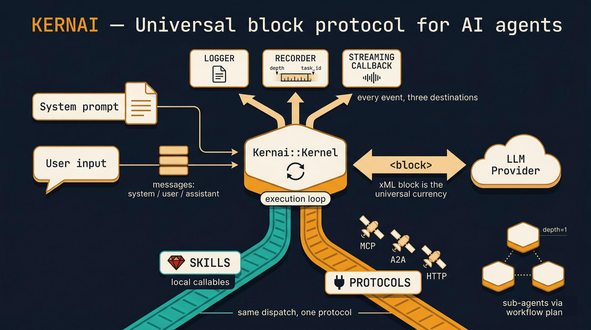
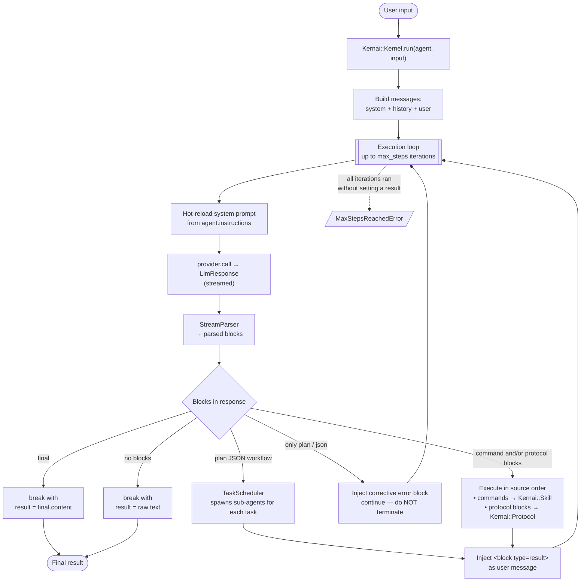
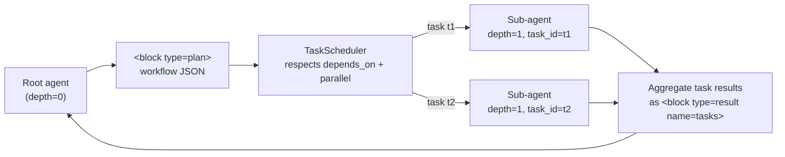
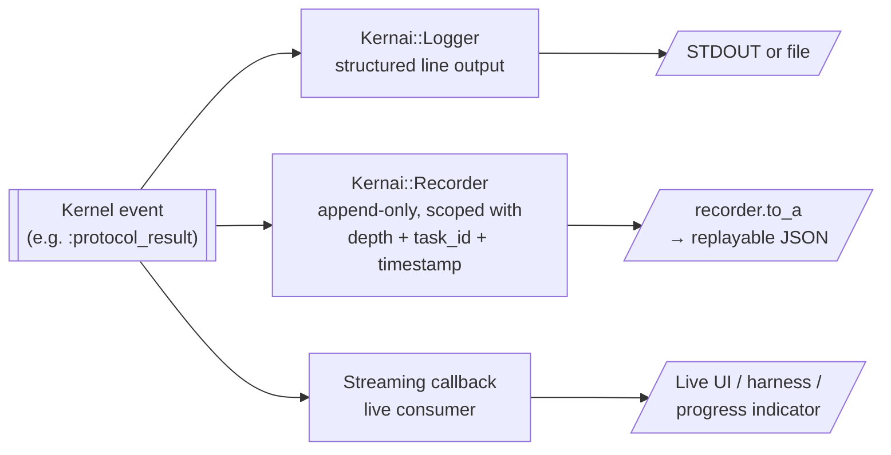

# Kernai

A minimal, extensible Ruby gem for building AI agents through a **universal structured block protocol** — with first-class **multimodal** support. Simple orchestration, dynamic skills, streaming, full observability — zero runtime dependencies.



---

## Table of Contents

- [Philosophy](#philosophy)
- [Installation](#installation)
- [Quick Start](#quick-start)
- [Multimodal Quick Start](#multimodal-quick-start)
- [Architecture](#architecture)
  - [Execution Flow](#execution-flow)
  - [Sub-Agents & Scoping](#sub-agents--scoping)
  - [Observability Rail](#observability-rail)
  - [Core Components](#core-components)
- [The Block Protocol](#the-block-protocol)
- [Conversation Model](#conversation-model)
- [Models & Capabilities](#models--capabilities)
- [Agent](#agent)
- [Skills](#skills)
- [Multimodal & Media](#multimodal--media)
- [Providers](#providers)
- [Protocols (MCP, A2A, …)](#protocols-mcp-a2a-)
- [Workflows](#workflows)
- [Streaming & Events](#streaming--events)
- [Observability & Recording](#observability--recording)
- [Configuration](#configuration)
- [Security](#security)
- [Example Conversation Tape](#example-conversation-tape)
- [Testing](#testing)
- [Scenarios](#scenarios)
- [Project Structure](#project-structure)
- [License](#license)

---

## Philosophy

- **Simplicity** over magic
- **Protocol** over abstraction
- **Backend control** over LLM control
- **Dynamic** over static
- **Pure conversation** over special roles
- **Capability-aware** over lowest-common-denominator
- **Zero runtime dependencies**

---

## Installation

Add to your Gemfile:

```ruby
gem "kernai"
```

Or install directly:

```sh
gem install kernai
```

Requires Ruby >= 3.0.

---

## Quick Start

```ruby
require "kernai"

# 1. Define a skill (a local tool the agent can call)
Kernai::Skill.define(:search) do
  description "Search the knowledge base"
  input :query, String

  execute do |params|
    MySearchEngine.query(params[:query])
  end
end

# 2. Implement a provider (LLM backend)
class MyProvider < Kernai::Provider
  def call(messages:, model:, &block)
    response = +""
    client.chat(model: model.id, messages: messages, stream: true) do |chunk|
      text = chunk.dig("choices", 0, "delta", "content") || ""
      block&.call(text)   # stream chunk to parser
      response << text
    end
    Kernai::LlmResponse.new(content: response, latency_ms: 0)
  end
end

# 3. Create an agent
agent = Kernai::Agent.new(
  instructions: "You are a helpful assistant. Use <block> XML tags to structure your responses.",
  provider: MyProvider.new,
  model: Kernai::Models::GPT_4O,
  max_steps: 10,
  skills: :all
)

# 4. Run
result = Kernai::Kernel.run(agent, "Find information about Ruby agents") do |event|
  case event.type
  when :text_chunk   then print event.data
  when :skill_result then puts "Skill executed: #{event.data[:skill]}"
  when :final        then puts "\nDone!"
  end
end
```

---

## Multimodal Quick Start

Agents consume and produce media natively — images, audio, video, documents — based on the model's declared capabilities.

**Passing an image as user input:**

```ruby
agent = Kernai::Agent.new(
  instructions: "Describe what you see.",
  provider: openai_provider,
  model: Kernai::Models::GPT_4O,   # declares :vision
  max_steps: 3
)

result = Kernai::Kernel.run(agent, [
  "What is in this image?",
  Kernai::Media.from_file("photo.jpg")
])
```

**A skill that produces an image:**

```ruby
Kernai::Skill.define(:render_chart) do
  description "Render a chart from a data series"
  input :series, Array
  produces :image           # informs the instruction builder + reporter
  execute do |params|
    bytes = ChartRenderer.png_for(params[:series])
    Kernai::Media.from_bytes(bytes, mime_type: "image/png")
  end
end
```

The kernel registers the returned `Media` in the context's `MediaStore`, injects a `<block type="media" id=.../>` reference in the conversation, and the next model turn sees the image natively — provided the model supports vision. If it doesn't, it's swapped for a `[image unavailable: image/png]` text placeholder and the loop keeps going.

**A skill that requires vision is hidden from text-only models:**

```ruby
Kernai::Skill.define(:inspect_receipt) do
  description "Extract line items from a receipt image"
  input :image, Kernai::Media
  requires :vision           # runnable only on vision-capable models
  execute { |params| OCR.call(params[:image]) }
end
```

See [Multimodal & Media](#multimodal--media) for the full contract.

---

## Architecture

### Execution Flow

Every call to `Kernai::Kernel.run(agent, input)` walks a single, fully deterministic loop. Each step produces one LLM response, classifies the blocks it contains, and dispatches them. The loop keeps going until the agent emits a `<final>` block, replies with plain prose (no blocks), or hits `max_steps`.



Two distinct exit paths:

- **Clean break** — `final` block or plain-prose response sets `result` inside the loop. The post-loop check returns it. Works even on the last allowed iteration: `max_steps` is a ceiling, not a forced early termination.
- **Exhaustion** — every iteration went through workflow, actionable, or informational-only branches and the agent never converged on a `final` or a plain-prose answer. `result` is still `nil`, and the post-loop check raises `MaxStepsReachedError`.

Key invariants the diagram encodes:

- **Commands and protocol blocks coexist** on the same rail and are executed in the order the LLM emitted them — one response can interleave `<block type="command">` and `<block type="mcp">` and both fire deterministically.
- **Informational-only turns don't terminate the loop.** If the agent emits only `<plan>` or `<json>` blocks, the kernel injects a corrective error block and gives it another step. This accommodates smaller models that split reasoning and action across turns.
- **Plain prose with no blocks** still terminates gracefully with the raw text as the result — so a pure chatbot agent (no skills, no protocols) works without any special case.

### Sub-Agents & Scoping

A workflow plan block expands into a DAG of sub-agents. Each sub-agent is an independent `Kernel.run` call with its own context, but it shares the parent's provider, model, skills, protocols, **`max_steps` budget, and `MediaStore`**.



Sub-agents **cannot** emit their own nested workflow plans — `ctx.root?` gates plan detection. This caps recursion at one level and keeps the observability tree legible. The shared `MediaStore` means a parent skill can produce an image that any sub-agent can subsequently reference by id.

### Observability Rail

Every meaningful event inside the kernel — LLM request/response, skill execution, protocol execution, workflow lifecycle, informational-only branch, task start/complete — fans out to **three destinations at once**.



Because every emission goes through the same `record(rec, ctx, ...)` helper, **nothing is ever recorded without its execution scope** (depth, task_id). The flat event stream can always be rebuilt into a parent/child tree by a consumer reading the log.

### Core Components

| Component | Role |
|-----------|------|
| **Kernel** | Execution loop — orchestrates messages, provider calls, block dispatch, skill + protocol execution |
| **Agent** | Configuration holder — instructions, provider, **model (capability-aware)**, max steps, skill + protocol whitelists |
| **Model** | Declarative description of an LLM: id + capabilities (`:text`, `:vision`, `:audio_in`, `:audio_out`, `:image_gen`, `:video_in`, `:document_in`) |
| **Media** | Immutable value object representing a piece of media (image/audio/video/document) with deterministic id, `from_file`/`from_url`/`from_bytes` constructors |
| **MediaStore** | Per-execution, thread-safe bag of `Media` keyed by id, shared between parent and sub-agents |
| **Message** | Conversation turn with `role` and an **ordered array of parts** (`String | Media`) |
| **Skill** | Local Ruby callables with typed inputs, `requires :capability` gating, `produces :kind` hints, and a thread-safe registry |
| **Protocol** | Registry of external protocol adapters (MCP, A2A, …) — each claims a block type |
| **Block** | Structured XML protocol unit with type (`command`, `final`, `json`, `plan`, `result`, `error`, `media`, or any registered protocol) and optional name |
| **Parser / StreamParser** | Regex (full) and state-machine (streaming) parsers for block extraction |
| **Provider** | Abstract LLM backend with streaming + multimodal encoding hooks |
| **LlmResponse** | Structured provider response with content + latency + token usage |
| **InstructionBuilder** | Assembles system prompts with block-protocol rules, skill hints, and capability-aware multimodal sections |
| **Recorder** | Append-only observability log, scoped with depth + task_id + timestamp |
| **Plan / Context / TaskScheduler** | Workflow DAG model, execution context, sub-agent DAG scheduler |
| **Config / Logger** | Global configuration and structured event logging |

---

## The Block Protocol

All structured communication between the LLM and the kernel uses XML blocks:

```xml
<block type="command" name="search">
  {"query": "Ruby agents"}
</block>

<block type="final">
  Here is the summarized result...
</block>
```

**Block types:**

| Type | Purpose | Kernel behavior |
|------|---------|-----------------|
| `command` | Invoke a skill (local Ruby callable) | Executes skill, injects result as `user` message, continues loop |
| *registered protocol* | Invoke an external protocol (e.g. `mcp`) | Dispatches to the registered handler, injects result, continues loop |
| `final` | Agent's final answer | Stops the loop, returns content |
| `plan` | Reasoning / chain of thought (or workflow JSON) | Emits `:plan` event, continues |
| `json` | Structured data output | Emits `:json` event, continues |
| `result` | Skill or protocol result (injected by kernel) | Read by LLM on next iteration |
| `error` | Skill or protocol error (injected by kernel) | Read by LLM on next iteration |
| `media` | Reference to a `Media` object in the store (injected alongside result) | Provider encodes natively or falls back to text placeholder |

**Hard rules** the `InstructionBuilder` injects as "non-negotiable":

- Every response MUST contain at least one `<block>`. Plain prose outside blocks is discarded.
- Never narrate intent in prose (`"I will now call..."`). Emit the block directly, or wrap reasoning in `<block type="plan">`.
- Multiple blocks per response are allowed and executed in source order.

---

## Conversation Model

The kernel maintains a standard conversation with three roles:

- **system** — Agent instructions (single message, always first, hot-reloaded every step)
- **user** — User input + internal communication (skill results/errors injected as `user` messages with block markup)
- **assistant** — LLM responses

`Message#content` is **always** an `Array<String | Media>` — no polymorphism at the consumer site:

```ruby
Message.new(role: :user, content: "hi")                    # → content: ["hi"]
Message.new(role: :user, content: [text, image])           # → content: [text, image]
Message.new(role: :user, content: Kernai::Media.from_url(url))  # → content: [media]
```

Helpers on `Message`: `#text` (joined textual view with media placeholders), `#media` (just the media parts), `#media?` (boolean).

This keeps the protocol compatible with any conversational LLM API while allowing arbitrary multimodal payloads to travel through the same message pipeline.

---

## Models & Capabilities

`Kernai::Agent#model` is a `Kernai::Model` — never a raw String. A `Model` declares its capabilities explicitly, and the kernel honours them at three seams:

1. **Skill filtering** — `/skills` only lists skills the current model can satisfy.
2. **Instruction builder sections** — the `MULTIMODAL INPUTS` / `MULTIMODAL OUTPUTS` appendices appear only when relevant.
3. **Provider encoding** — each provider's `encode_part` decides what to do based on the model's capabilities, and degrades to a text placeholder otherwise.

**Declaring a custom model:**

```ruby
Kernai::Model.new(
  id: "my-special-model",
  capabilities: %i[text vision audio_in]
)
```

**Full capability vocabulary:**

| Capability | Meaning |
|---|---|
| `:text` | Can accept and emit text (the baseline) |
| `:vision` | Can see images passed as input |
| `:audio_in` | Can hear audio passed as input |
| `:audio_out` | Can emit synthesised audio |
| `:video_in` | Can watch video passed as input |
| `:document_in` | Can ingest PDFs / documents |
| `:image_gen` | Can emit generated images |

**Pre-declared catalogue** (`Kernai::Models::*`):

| Constant | Model id | Capabilities |
|---|---|---|
| `TEXT_ONLY` | `text-only` | `text` |
| `CLAUDE_OPUS_4` | `claude-opus-4-20250514` | `text`, `vision` |
| `CLAUDE_SONNET_4` | `claude-sonnet-4-20250514` | `text`, `vision` |
| `CLAUDE_HAIKU_4_5` | `claude-haiku-4-5-20251001` | `text`, `vision` |
| `GPT_4O` | `gpt-4o` | `text`, `vision`, `audio_in`, `audio_out` |
| `GPT_4O_MINI` | `gpt-4o-mini` | `text`, `vision` |
| `GEMINI_2_5_PRO` | `gemini-2.5-pro` | `text`, `vision`, `audio_in`, `video_in`, `document_in` |
| `LLAMA_3_1` | `llama3.1` | `text` |
| `LLAVA` | `llava` | `text`, `vision` |

The catalogue is intentionally minimal — add whatever your stack needs. No hidden registry, no autodetection.

---

## Agent

```ruby
agent = Kernai::Agent.new(
  instructions: "You are a helpful assistant...",
  provider: MyProvider.new,
  model: Kernai::Models::GPT_4O,
  max_steps: 10,
  skills: :all,                       # nil | :all | Array<Symbol>
  protocols: [:mcp]                   # nil | [] | Array<Symbol>
)
```

### Dynamic Instructions (Hot Reload)

Instructions can be a lambda, re-evaluated at each execution step:

```ruby
agent = Kernai::Agent.new(
  instructions: -> { PromptStore.fetch_current },
  model: Kernai::Models::CLAUDE_SONNET_4,
  provider: provider
)
```

Or updated mid-execution:

```ruby
agent.update_instructions("New instructions...")
```

---

## Skills

### Defining Skills

```ruby
Kernai::Skill.define(:database_query) do
  description "Execute SQL queries"

  input :sql, String                   # Required
  input :timeout, Integer, default: 30 # Optional with default

  execute do |params|
    DB.execute(params[:sql], timeout: params[:timeout])
  end
end
```

Skills validate parameter types at call time and apply defaults automatically.

### Multimodal DSL Extensions

```ruby
Kernai::Skill.define(:inspect_receipt) do
  description "Extract line items from a receipt"
  input :image, Kernai::Media
  requires :vision                     # gating: hidden on text-only models
  produces :document                   # optional hint for observability
  execute { |p| OCR.extract(p[:image]) }
end
```

- `requires :cap, ...` — accumulates required model capabilities. `Skill#runnable_on?(model)` returns `true` only if all are satisfied. Filtered-out skills are hidden from the `/skills` listing.
- `produces :kind, ...` — purely declarative hint. The kernel + reporter use it to route output and label the produced media.

### Registry

```ruby
Kernai::Skill.all                           # List all skills
Kernai::Skill.find(:search)                 # Lookup by name
Kernai::Skill.register(skill)               # Manual registration
Kernai::Skill.unregister(:search)           # Remove a skill
Kernai::Skill.reset!                        # Clear all
Kernai::Skill.listing(scope, model: model)  # Render the /skills text
```

### Hot Reload

Skills can be loaded from files and reloaded at runtime without restart:

```ruby
Kernai::Skill.load_from("app/skills/**/*.rb")

# Later, after files change:
Kernai::Skill.reload!
```

The registry is thread-safe (Mutex-protected).

### Parameter Parsing

When the LLM sends a command block, the kernel parses parameters automatically:

- **JSON content** — parsed as a hash: `{"sql": "SELECT 1", "timeout": 60}`
- **Plain text + single input** — wrapped into the skill's input name: `"SELECT 1"` becomes `{sql: "SELECT 1"}`
- **Plain text + multiple inputs** — fallback to `{input: "..."}` 

### Return values

A skill's `execute` block can return:

| Value | Kernel behavior |
|---|---|
| `String` | Wrapped as `<block type="result" name="...">text</block>` |
| `Kernai::Media` | Registered in the store, injected as a `<block type="media"/>` reference + the Media object as a part |
| `Array<String \| Media>` | Each element is handled according to its type, in order |
| `nil` or other | Coerced via `.to_s` |

See [Multimodal & Media](#multimodal--media) for the end-to-end flow.

---

## Multimodal & Media

### `Kernai::Media`

Immutable value object. Three construction shapes:

```ruby
Kernai::Media.from_file("photo.jpg")
Kernai::Media.from_url("https://example.com/cat.png")
Kernai::Media.from_bytes(raw_bytes, mime_type: "image/png")
```

Attributes: `kind` (`:image | :audio | :video | :document`), `mime_type`, `source` (`:path | :url | :bytes`), `data`, `metadata`, `id` (deterministic SHA1 prefix of the payload, stable across equal media).

Helpers: `#read_bytes` (materialises bytes regardless of source; raises for URL-backed media), `#to_base64`, `#to_h`, `#url? / #path? / #bytes?`.

### Passing media to an agent

`Kernai::Kernel.run` accepts `String | Media | Array<String | Media>` as input:

```ruby
Kernai::Kernel.run(agent, [
  "Describe this:",
  Kernai::Media.from_file("diagram.png")
])
```

Any `Media` in the input is registered in the context's `MediaStore` before the first LLM call, so downstream skills can look it up by id.

### Skills that produce media

```ruby
Kernai::Skill.define(:render_chart) do
  description "Render a chart for a data series"
  input :series, Array
  produces :image
  execute do |p|
    Kernai::Media.from_bytes(ChartRenderer.png_for(p[:series]), mime_type: "image/png")
  end
end
```

When the skill runs, the kernel:

1. Normalises the return through `Kernai::SkillResult.wrap` → `Array<String | Media>`.
2. Registers each `Media` in `ctx.media_store`.
3. Builds the result message with a text `<block type="result" name="render_chart">...</block>` **followed by** a `<block type="media" id="..." kind="image" mime="image/png"/>` reference AND the `Media` object as a part.
4. On the next LLM call, the provider encodes the message, and the vision-capable model sees the image natively.

### Capability-driven skill filtering

Skills with `requires :vision` are hidden from text-only models' `/skills` listing:

```ruby
text_model = Kernai::Model.new(id: "text", capabilities: %i[text])
Kernai::Skill.listing(:all, model: text_model)
# → only skills whose `requires` list is empty or satisfiable by `text`
```

### Provider encoding contract

The base `Kernai::Provider` exposes two hooks:

```ruby
def encode(parts, model:)
  # Walks each part through encode_part. Nil returns fall back to a
  # text placeholder, and the placeholder is itself re-encoded through
  # encode_part so the subclass can wrap it in its own text envelope.
  # The resulting array is always homogeneous.
end

def encode_part(part, model:)
  # Override point. Return the vendor-native shape for `part`, or nil
  # to let the base class emit a textual fallback.
end
```

**Fallback behavior.** If a model doesn't declare the right capability, the part is swapped for a placeholder such as `"[image unavailable: image/png]"` and the loop keeps going — no crashes, no silent drops. The instruction builder already hid vision-gated skills from such models, so the situation typically only arises when the user directly passes a media input.

### Built-in provider adapters

Three reference implementations live under `examples/providers/`:

| Provider | Vision encoding | Notes |
|---|---|---|
| `AnthropicProvider` | `{type: image, source: {type: base64, media_type, data}}` or `{type: url, url}` | Always wraps strings as `{type: text, text}` for homogeneous arrays |
| `OpenaiProvider` | `{type: image_url, image_url: {url}}` with data-URI fallback for inline bytes | Always wraps strings as `{type: text, text}` |
| `OllamaProvider` | Base64 bytes in the message-level `images` array | Tagged internal parts (`{type: :text}` / `{type: :image}`) to disambiguate text from base64 |

### Round-trip example

See `scenarios/multimodal_*.rb` for runnable end-to-end examples against real providers: `multimodal_describe_image` (image input), `multimodal_ocr_skill` (image + vision-gated skill), `multimodal_generate_image_skill` (skill returns a `Media`, model describes it), `multimodal_text_only_fallback` (forced text-only degradation).

---

## Providers

Implement the abstract `Kernai::Provider` to connect any LLM:

```ruby
class OpenAIProvider < Kernai::Provider
  def call(messages:, model:, &block)
    started = Process.clock_gettime(Process::CLOCK_MONOTONIC)
    response = +""

    client.chat(
      model: model.id,
      messages: messages.map { |m|
        { "role" => m[:role].to_s, "content" => encode(m[:content], model: model) }
      },
      stream: true
    ) do |chunk|
      text = chunk.dig("choices", 0, "delta", "content") || ""
      block&.call(text)
      response << text
    end

    Kernai::LlmResponse.new(
      content: response,
      latency_ms: ((Process.clock_gettime(Process::CLOCK_MONOTONIC) - started) * 1000).to_i
    )
  end

  # Multimodal: wrap strings as text parts, encode images natively.
  def encode_part(part, model:)
    return { "type" => "text", "text" => part } if part.is_a?(String)
    return nil unless part.is_a?(Kernai::Media) && part.kind == :image && model.supports?(:vision)

    url = part.url? ? part.data : "data:#{part.mime_type};base64,#{part.to_base64}"
    { "type" => "image_url", "image_url" => { "url" => url } }
  end
end
```

**Resolution order:** `Kernel.run(provider:)` override > `agent.provider` > `Kernai.config.default_provider` > `ProviderError`.

**LlmResponse** carries: `content`, `latency_ms`, `prompt_tokens`, `completion_tokens`, `total_tokens`. Providers leave unknown fields `nil`; the kernel and recorder handle that uniformly.

---

## Protocols (MCP, A2A, …)

Skills are **local** Ruby callables the agent invokes via `<block type="command">`. Protocols are **external** systems the agent addresses via their own block type. Both rails coexist and are dispatched by the kernel with the same observability guarantees.

A protocol is any structured, extensible interface (MCP, A2A, a custom in-house system, …) that doesn't fit the "local Ruby function" model.

### Registering a protocol

```ruby
Kernai::Protocol.register(:my_proto, documentation: <<~DOC) do |block, ctx|
  My custom protocol. Accepts JSON requests and returns a string.
DOC
  request = JSON.parse(block.content)
  MyBackend.handle(request)
end
```

The agent addresses the protocol directly:

```xml
<block type="my_proto">{"action": "do_something", "args": {"x": 1}}</block>
```

Results come back in `<block type="result" name="my_proto">`, errors in `<block type="error" name="my_proto">` — exactly like skills.

### Handler contract

A protocol handler receives `(block, ctx)` and may return:

- a **String** — the kernel wraps it as `<block type="result" name="...">`.
- a **`Kernai::Message`** — used as-is (handler controls role and content entirely).

Any `StandardError` the handler raises is caught by the kernel and wrapped as an error block so the agent can observe and recover.

### Built-in `/protocols` discovery

```xml
<block type="command" name="/protocols"></block>
```

Returns a JSON array `[{"name": "mcp", "documentation": "..."}]` that the agent can read to discover which external systems it has access to.

### Agent-level whitelist

```ruby
Kernai::Agent.new(
  instructions: "...",
  provider: provider,
  model: Kernai::Models::CLAUDE_SONNET_4,
  protocols: [:mcp]    # nil = all, [] = none, [:mcp] = whitelist
)
```

### MCP adapter (optional)

Kernai ships an optional MCP (Model Context Protocol) adapter that registers the `:mcp` protocol and bridges to the `ruby-mcp-client` gem:

```ruby
# Gemfile
gem 'ruby-mcp-client'
gem 'base64'   # required on Ruby >= 3.4 — ruby-mcp-client uses base64
               # internally without declaring it as a runtime dependency
```

```ruby
require 'kernai'
require 'kernai/mcp'   # opt-in — requires the `ruby-mcp-client` gem

Kernai::MCP.load('config/mcp.yml')
```

Example `config/mcp.yml`:

```yaml
servers:
  filesystem:
    transport: stdio
    command: npx
    args: ["-y", "@modelcontextprotocol/server-filesystem", "/tmp"]

  github:
    transport: sse
    url: https://mcp.example.com/sse
    headers:
      Authorization: "Bearer ${GITHUB_MCP_TOKEN}"
```

The agent then speaks MCP's native verbs directly:

```xml
<block type="mcp">{"method":"servers/list"}</block>
<block type="mcp">{"method":"tools/list","params":{"server":"filesystem"}}</block>
<block type="mcp">{"method":"tools/call","params":{
  "server":"filesystem","name":"read_text_file",
  "arguments":{"path":"/tmp/notes.md"}
}}</block>
```

Supported methods (MCP spec + one Kernai extension):

| Method | Purpose |
|---|---|
| `servers/list` | *(Kernai ext)* list configured MCP servers |
| `tools/list` | list tools, optionally filtered by `server` |
| `tools/describe` | full JSON schema for one tool |
| `tools/call` | execute a tool with arguments |
| `resources/list` | list resources on a server |
| `resources/read` | read a resource by URI |
| `prompts/list` | list prompts on a server |
| `prompts/get` | render a prompt template with arguments |

Environment variables of the form `${VAR}` in the YAML config are expanded from `ENV` at load time — no secrets need to live in the file.

**Zero runtime dependency preserved:** `require 'kernai'` still pulls in nothing external. `require 'kernai/mcp'` only succeeds if you've added `gem 'ruby-mcp-client'` (and `gem 'base64'` on Ruby >= 3.4) to your Gemfile.

---

## Workflows

A single LLM response can emit a **workflow plan** — a JSON DAG of sub-tasks executed by a scheduler. Each task runs as an isolated sub-agent sharing the parent's configuration, `max_steps` budget, and `MediaStore`.

```xml
<block type="plan">
{
  "goal": "Triage the incident",
  "strategy": "parallel",
  "tasks": [
    { "id": "logs",    "input": "Fetch error logs",      "parallel": true },
    { "id": "metrics", "input": "Fetch service metrics", "parallel": true },
    { "id": "summary", "input": "Summarise findings",    "depends_on": ["logs", "metrics"] }
  ]
}
</block>
```

Results come back as:

```xml
<block type="result" name="tasks">
{"logs": "...", "metrics": "...", "summary": "..."}
</block>
```

**Built-in commands:**

- `/workflow` — show the structured plan format documentation
- `/tasks` — show the current task execution state (id, input, status, depends_on)

**Rules** (enforced by the kernel and made visible to the agent):

- Tasks with `parallel: true` run concurrently; others run sequentially.
- A task waits for every id in `depends_on` to finish first.
- Sub-agents cannot themselves emit nested plans.
- Invalid plans are silently ignored (fail-safe).

---

## Streaming & Events

The kernel streams LLM output through a state-machine parser that handles XML tags split across chunk boundaries. Pass a block to `Kernel.run` to consume live events:

```ruby
Kernai::Kernel.run(agent, input) do |event|
  case event.type
  when :text_chunk        then print event.data
  when :block_start       then log_block(event.data[:type], event.data[:name])
  when :block_content     then buffer << event.data
  when :plan              then log_reasoning(event.data)
  when :json              then process_data(event.data)
  when :skill_result      then track(event.data)
  when :skill_error       then handle_error(event.data)
  when :protocol_execute  then notify_protocol(event.data)
  when :protocol_result   then notify_protocol(event.data)
  when :protocol_error    then notify_protocol_error(event.data)
  when :builtin_result    then log_builtin(event.data)
  when :task_start        then progress_start(event.data)
  when :task_complete     then progress_done(event.data)
  when :task_error        then progress_error(event.data)
  when :workflow_start    then log_workflow_start(event.data)
  when :workflow_complete then log_workflow_done(event.data)
  when :informational_only then warn_agent(event.data)
  when :final             then display(event.data)
  end
end
```

Every event carries structured data — see `lib/kernai/kernel.rb` for the exact shapes.

---

## Observability & Recording

```ruby
recorder = Kernai::Recorder.new
Kernai::Kernel.run(agent, input, recorder: recorder)

recorder.to_a                 # → array of scoped entries
recorder.for_event(:skill_result)
recorder.for_step(0)
```

Each entry carries: `step`, `event`, `data`, `timestamp`, `depth`, `task_id`. The flat stream can be reconstructed into a parent/child tree by any consumer.

**Logger** — structured line output via `Kernai.logger` (silence it by setting `Kernai.config.logger = Kernai::Logger.new(StringIO.new)`).

**Live callback** — the block passed to `Kernel.run` receives every event the moment it fires, ideal for progress bars, live UIs, or the built-in scenario harness.

All three channels receive the same events in the same order.

---

## Configuration

```ruby
Kernai.configure do |c|
  c.debug = true                            # Enable debug logging
  c.default_provider = MyProvider.new       # Fallback provider
  c.allowed_skills = [:search, :calculate]  # Whitelist (nil = all allowed)
  c.recorder = Kernai::Recorder.new         # Global recorder
  c.logger = Kernai::Logger.new($stderr)    # Structured logger
end
```

`Kernai.reset!` clears global state (config, skill registry, protocol registry) — used by the test suite between examples.

---

## Security

- **Max steps** — Every agent has a `max_steps` limit (default: 10). Raises `MaxStepsReachedError` if the loop doesn't terminate.
- **Skill whitelist** — Restrict which skills an agent can invoke via `config.allowed_skills`. Unauthorized calls inject an `<block type="error">` instead of executing.
- **Protocol whitelist** — Same mechanism at the agent level (`agent.protocols`).
- **Capability gating** — Skills that `requires` a missing capability are hidden from the agent entirely.
- **Provider abstraction** — All LLM communication goes through a pluggable interface, enabling request inspection, auth, redaction, rate limiting.
- **MCP env expansion** — `${VAR}` placeholders let you keep secrets out of `config/mcp.yml`.

---

## Example Conversation Tape

What an actual exchange looks like on the wire, for an agent that has a local `translate` skill AND access to an MCP filesystem server. This is the complete message tape as Kernai assembles and sends it to the provider on each step — exactly what you'd see by dumping `:messages_sent` from the recorder.

```text
┌── System ──────────────────────────────────────────────────────────┐
│ [Your agent.instructions text]                                     │
│                                                                    │
│ ## RESPONSE FORMAT (non-negotiable)                                │
│ You communicate EXCLUSIVELY through XML blocks.                    │
│ ... [block types, /skills, /protocols rules injected by            │
│      Kernai::InstructionBuilder] ...                               │
└────────────────────────────────────────────────────────────────────┘
┌── User ────────────────────────────────────────────────────────────┐
│ Read /tmp/notes/hello.txt via MCP and translate its first line     │
│ to French.                                                         │
└────────────────────────────────────────────────────────────────────┘

═════════════════════════════ step 0 ═════════════════════════════

┌── Assistant (LLM) ─────────────────────────────────────────────────┐
│ <block type="plan">                                                │
│ I don't know the file contents. I'll read it via the MCP           │
│ filesystem server, then translate the first line with the local    │
│ translate skill.                                                   │
│ </block>                                                           │
│ <block type="mcp">                                                 │
│ {"method":"tools/call","params":{                                  │
│   "server":"fs",                                                   │
│   "name":"read_text_file",                                         │
│   "arguments":{"path":"/tmp/notes/hello.txt"}                      │
│ }}                                                                 │
│ </block>                                                           │
└────────────────────────────────────────────────────────────────────┘

   ↓ kernel dispatches the <mcp> block to the Protocol :mcp handler,
     which forwards it to ruby-mcp-client and gets the file contents
     back as a String. Events :protocol_execute and :protocol_result
     are emitted to the logger + recorder + streaming callback.

┌── User (injected by kernel) ───────────────────────────────────────┐
│ <block type="result" name="mcp">                                   │
│ Hello, world!                                                      │
│ This is a second line of notes.                                    │
│ </block>                                                           │
└────────────────────────────────────────────────────────────────────┘

═════════════════════════════ step 1 ═════════════════════════════

┌── Assistant (LLM) ─────────────────────────────────────────────────┐
│ <block type="plan">                                                │
│ Got the contents. The first line is "Hello, world!". Now I call    │
│ the translate skill.                                               │
│ </block>                                                           │
│ <block type="command" name="translate">                            │
│ {"text":"Hello, world!","target":"fr"}                             │
│ </block>                                                           │
└────────────────────────────────────────────────────────────────────┘

   ↓ kernel dispatches the <command> to Kernai::Skill[:translate],
     passes the JSON as kwargs, and receives the translation.
     Events :skill_execute and :skill_result are emitted.

┌── User (injected by kernel) ───────────────────────────────────────┐
│ <block type="result" name="translate">                             │
│ Bonjour, le monde !                                                │
│ </block>                                                           │
└────────────────────────────────────────────────────────────────────┘

═════════════════════════════ step 2 ═════════════════════════════

┌── Assistant (LLM) ─────────────────────────────────────────────────┐
│ <block type="final">                                               │
│ The first line of /tmp/notes/hello.txt is "Hello, world!",         │
│ which translates to "Bonjour, le monde !" in French.               │
│ </block>                                                           │
└────────────────────────────────────────────────────────────────────┘

   ↓ <final> exits the loop. Kernel.run returns:
     "The first line of /tmp/notes/hello.txt is \"Hello, world!\",
      which translates to \"Bonjour, le monde !\" in French."
```

Things to note:

- **The conversation grows linearly.** The model sees every previous turn — Kernai never hides anything.
- **`<plan>` blocks survive.** They're emitted to the `:plan` event channel for observability, but they stay in the assistant message the LLM sees on the next turn — so the model's chain-of-thought is visible to itself across turns.
- **Informational-only turns recover gracefully.** If step 0 had emitted only `<plan>` (no `<mcp>`), the kernel would have injected a corrective `<block type="error">` and given the agent another step.
- **Skills and protocols are symmetric.** Both rails run through the same dispatch, in source order, with identical observability.

---

## Testing

Kernai ships with `Kernai::Mock::Provider` for testing:

```ruby
provider = Kernai::Mock::Provider.new
provider.respond_with(
  '<block type="command" name="search">test</block>',
  '<block type="final">Done</block>'
)

agent = Kernai::Agent.new(instructions: "...", provider: provider)
result = Kernai::Kernel.run(agent, "test")

assert_equal "Done", result
assert_equal 2, provider.call_count
```

`Mock::Provider` also exposes:

- `respond_with(*texts)` — queue of responses consumed in order (last one repeats).
- `on_call { |messages, model| ... }` — dynamic handler taking precedence over the queue.
- `with_token_counter { |messages, content| {...} }` — deterministic token usage for assertions.
- `calls`, `last_call`, `call_count` — inspect what was actually sent.

Run the test suite:

```sh
bundle exec rake test          # 460+ tests, runs in under 400 ms
bundle exec rubocop            # clean baseline
```

VCR cassettes back the example provider tests so the suite stays green without network access. To re-record, set `VCR_RECORD=new` (new episodes) or `VCR_RECORD=all` (full overwrite).

---

## Scenarios

`scenarios/` is a sandbox of end-to-end runs against real providers (OpenAI, Anthropic, Ollama) with a reporter, recorder, and JSON logs. Every scenario is a standalone `.rb` file using a tiny DSL:

```ruby
require_relative "harness"

Scenarios.define("inventory_lookup", description: "Warehouse agent queries the inventory skill") do
  instructions <<~PROMPT
    You are a warehouse inventory assistant...
  PROMPT

  skill(:inventory) do
    description "Look up product inventory"
    input :query, String
    execute { |p| JSON.generate(DB.lookup(p[:query])) }
  end

  input "Which products are out of stock?"
  max_steps 5
end
```

Run it:

```sh
ruby scenarios/inventory_lookup.rb                               # default (ollama)
ruby scenarios/inventory_lookup.rb gpt-4o openai                 # model + provider
PROVIDER=anthropic MODEL=claude-sonnet-4-20250514 ruby scenarios/inventory_lookup.rb
```

The harness writes a full JSON log to `scenarios/logs/<name>_<model>_<timestamp>.json` containing the recorder stream, and appends a one-line summary to `scenarios/logs/manifest.json`.

### Multimodal scenarios

Four scenarios specifically exercise the multimodal pipeline end to end:

| Scenario | Validates |
|---|---|
| `multimodal_describe_image.rb` | Vision input → model describes the shapes in `fixtures/four_shapes.jpg` |
| `multimodal_ocr_skill.rb` | Vision input + a `requires :vision` skill → the agent catalogues the shapes via the skill |
| `multimodal_generate_image_skill.rb` | Skill returns a `Kernai::Media` → model sees it natively in the next turn and describes it |
| `multimodal_text_only_fallback.rb` | Forced `capabilities [:text]` → the provider degrades the image to a text placeholder, the agent asks for a description |

All four are validated on **gpt-4o**, **claude-sonnet-4**, and **gemma3:27b** (via Ollama). Run them the same way as any other scenario.

### Scenario DSL reference

```ruby
Scenarios.define(name, description: ...) do
  instructions(text_or_lambda)       # system prompt
  skill(:name) { ... }               # Kernai::Skill.define-equivalent, scoped to the scenario
  protocols([:mcp])                  # optional protocol whitelist
  mcp_config("config/mcp.yml")       # optional MCP server config
  capabilities([:text, :vision])     # override inferred model capabilities
  input("text" | Media | Array)      # user input (supports multimodal)
  max_steps 5                        # budget
end
```

### Cross-run matrix

`scenarios/run_matrix.rb` runs every scenario against every `(provider, model)` pair declared in `MATRIX`, prints a colored summary table, and writes a matrix JSON under `scenarios/logs/`.

---

## Project Structure

```
lib/kernai/
  agent.rb               # Agent config + skill/protocol whitelists
  kernel.rb              # Execution loop, skill + protocol dispatch
  skill.rb               # Skill DSL, registry, capability gating
  skill_result.rb        # Normalises skill return values to parts
  protocol.rb            # Generic protocol registry (pluggable block types)
  mcp.rb                 # Optional MCP adapter (requires ruby-mcp-client)
  block.rb               # Block abstraction
  parser.rb              # Regex-based block parser (complete text)
  stream_parser.rb       # State-machine block parser (streaming)
  message.rb             # Conversation message with Array<String|Media> content
  media.rb               # Immutable Media value object
  media_store.rb         # Per-context bag of Media keyed by id
  model.rb               # Model + capabilities + Kernai::Models catalogue
  provider.rb            # Abstract LLM provider with encode_part hook
  llm_response.rb        # Structured provider response with observability metadata
  instruction_builder.rb # Assembles system prompts with capability-aware sections
  recorder.rb            # Append-only observability log (depth + task_id scoped)
  plan.rb                # Workflow plan + task model
  context.rb             # Execution context (depth, current task, media store)
  task_scheduler.rb      # DAG-aware sub-agent scheduler
  config.rb              # Global configuration
  logger.rb              # Structured event logging
  mock/
    provider.rb          # Mock provider for testing

examples/providers/
  anthropic_provider.rb  # Reference Anthropic adapter with vision support
  openai_provider.rb     # Reference OpenAI adapter with vision support
  ollama_provider.rb     # Reference Ollama adapter with vision support

scenarios/
  harness.rb             # Scenario DSL, provider registry, reporter, recorder
  multimodal_*.rb        # Vision / fallback end-to-end scenarios
  fixtures/              # Offline test assets (images)
  logs/                  # Recorder dumps + manifest.json
```

---

## License

MIT
